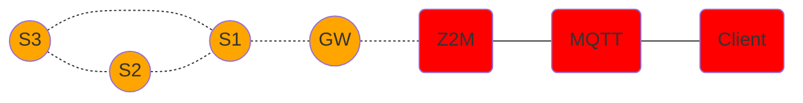

```mermaid
graph LR;
  1((S3)):::someclass -.- 3((S1));
  2((S2)):::someclass -.- 3((S1));
  1((S3)):::someclass -.- 2((S2));
  3((S1)):::someclass -.- 4((GW));
  4((GW)):::someclass -.- 5(Z2M);
  5(Z2M):::someclass2 --- 6(MQTT);
  6(MQTT):::someclass2 --- 7(Client):::someclass2;

classDef someclass fill:#FFA500;
classDef someclass2 fill:#FF0000;
```
